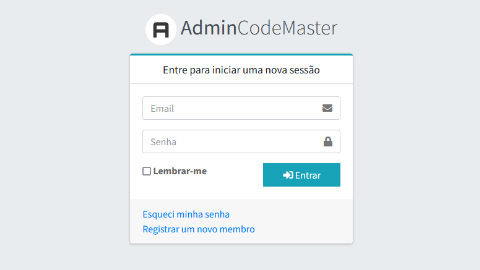
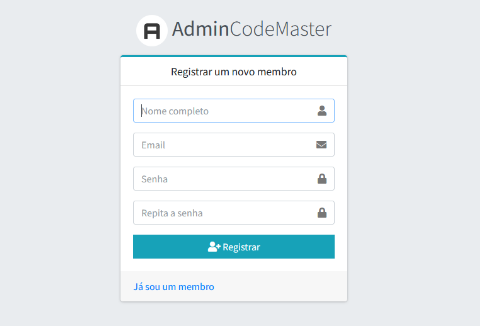
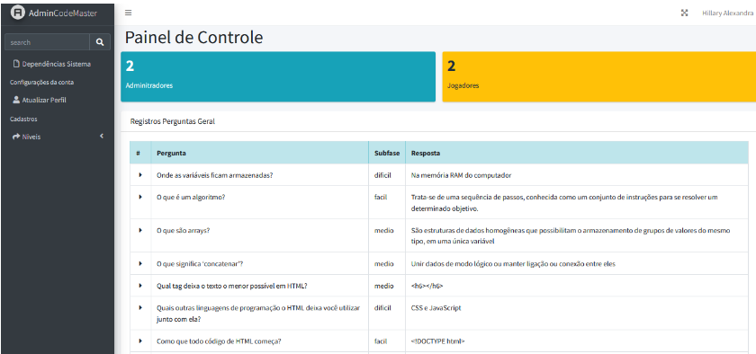
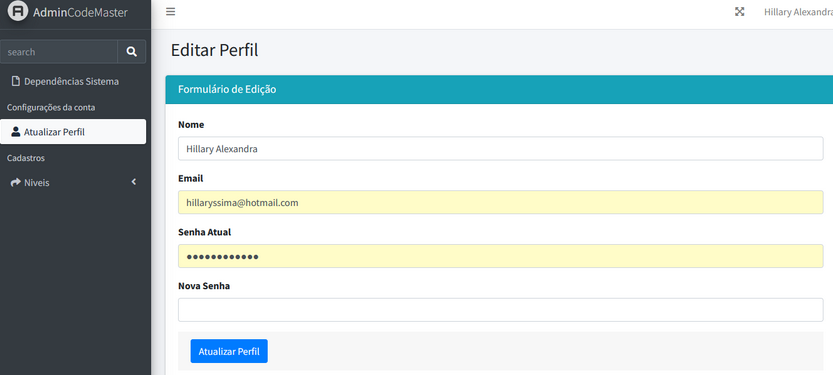
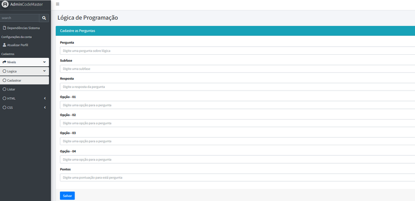
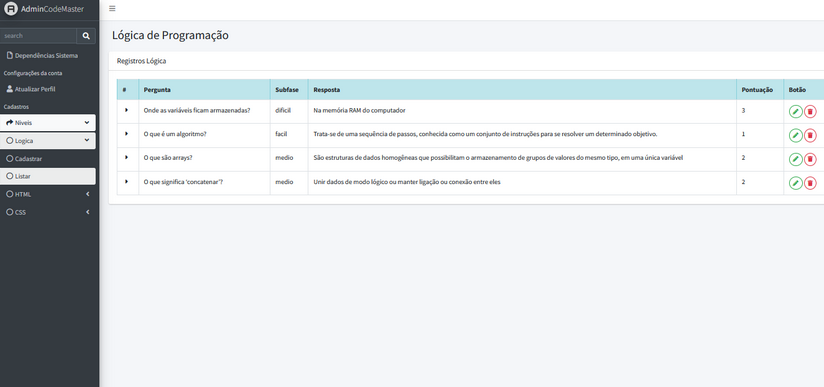
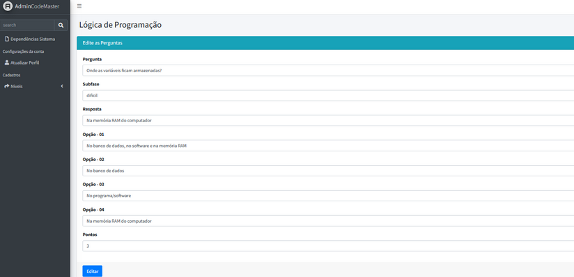

    
    <h4>ADMIN-CODEMASTER</h4>

<h5>## ADMIN - CODEMASTER: UMA PLATAFORMA PARA AUXILIAR NA MANUTENÇÃO DO JOGO CODEMASTER</h5>

<b>Neste projeto foi desenvolvido uma plataforma para ajudar na manutenção do jogo CodeMaster, que permita aos usuários editar dados do jogo original</b>

<h3>LINGUAGENS E FRAMEWORKS</h3>
- PHP; 
- LARAVEL 9; 
- JAVASCRIPT; 

<h3>DESENVOLVIMENTO</h3>

    <b>Página inicial Login</b> 
     
    
    

      <b>Página Registro</b> 
     
    
    

      <b>Página Inicial</b> 
     
    
    

      <b>Página Atualizar senha</b> 
     
    
      

      <b>Página Cadastrar pergunta</b> 
     
    
     

      <b>Página Listar perguntas</b> 
     
    
    

      <b>Página Editar perguntas</b> 
     
    
    

     <b>Página Listar perguntas</b> 
     
    

